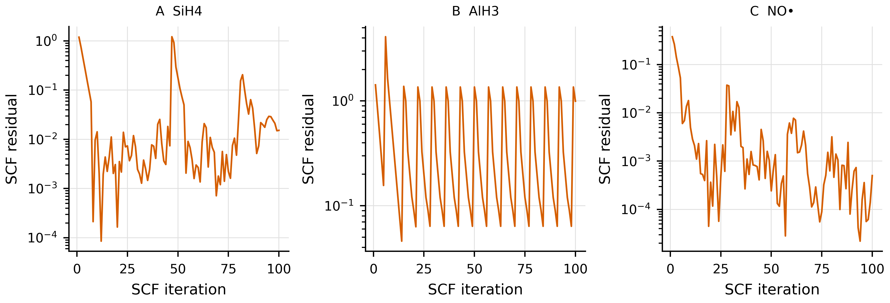

# Skala MOLOPT analysis on dietGMTKN55

This is a curated copy of the numerical report supplied with the raw
GPW/GTH data.  The SCF-failure figure is retained alongside this file.  The
reaction-error comparison figure referenced in the source report was not part
of the shared data bundle.

The CP2K/MOLOPT run converged for **75 of 100 reactions** and
**200 of 236 molecular calculations**.
Unless explicitly marked as excluding O3, metrics use the same
75-reaction common subset. The subset WTMAD is the mean absolute
dietGMTKN55-weighted error or method difference over that subset, not the official
full-benchmark WTMAD.

This is not a basis-only comparison. CP2K/Def2 uses the all-electron
**def2-TZVP, ma-def2-TZVP** basis family, including ma-def2-TZVP for diffuse-tagged reactions
and **def2-ECP** where an ECP is required. CP2K/MOLOPT instead uses
**TZVP-MOLOPT-SCAN-GTH** with **GTH-SCAN** pseudopotentials for every reaction.

## Metrics against the reference

| Comparison | │  | N (75) | MAD (75) | WTMAD (75) | │ | N (74) | MAD (74) | WTMAD (74) |
|---|---:|---:|---:|---:|---:|---:|---:|---:|
| PySCF/Def2 vs reference | │ | 75 | 0.985 | 3.840 | │ | 74 | 0.875 | 3.869 |
| CP2K/Def2 vs reference | │ | 75 | 0.978 | 3.849 | │ | 74 | 0.865 | 3.878 |
| CP2K/MOLOPT vs reference | │ | 75 | 1.971 | 5.656 | │ | 74 | 1.085 | 5.559 |

## MOLOPT against Def2

| Comparison | │  | N (75) | MAD (75) | WTMAD (75) | MSE (75) | │ | N (74) | MAD (74) | WTMAD (74) | MSE (74) |
|---|---:|---:|---:|---:|---:|---:|---:|---:|---:|---:|
| CP2K/MOLOPT vs PySCF/Def2 | │ | 75 | 1.914 | 5.934 | -0.898 | │ | 74 | 1.152 | 5.865 | -0.122 |
| CP2K/MOLOPT vs CP2K/Def2 | │ | 75 | 1.911 | 5.739 | -0.856 | │ | 74 | 1.151 | 5.667 | -0.081 |

Reference errors use `reference − calculated`; pairwise MSE uses
`MOLOPT − Def2`.

## Sensitivity to the O3 outlier and diffuse-tagged reactions

| Subset | Program | Basis set | N | MAD | WTMAD |
|---|---:|---:|---:|---:|---:|
| All common | PySCF | Def2-TZVP | 75 | 0.985 | 3.840 |
| All common | CP2K | Def2-TZVP | 75 | 0.978 | 3.849 |
| All common | CP2K | MOLOPT-TZVP | 75 | 1.971 | 5.656 |
| ━━━━ | ━━━━ | ━━━━ | ━━━━ | ━━━━ | ━━━━ |
| All common excluding O3 | PySCF | Def2-TZVP | 74 | 0.875 | 3.869 |
| All common excluding O3 | CP2K | Def2-TZVP | 74 | 0.865 | 3.878 |
| All common excluding O3 | CP2K | MOLOPT-TZVP | 74 | 1.085 | 5.559 |
| ━━━━ | ━━━━ | ━━━━ | ━━━━ | ━━━━ | ━━━━ |
| Non-diffuse | PySCF | Def2-TZVP | 66 | 0.952 | 4.104 |
| Non-diffuse | CP2K | Def2-TZVP | 66 | 0.958 | 4.106 |
| Non-diffuse | CP2K | MOLOPT-TZVP | 66 | 1.984 | 5.900 |
| ━━━━ | ━━━━ | ━━━━ | ━━━━ | ━━━━ | ━━━━ |
| Non-diffuse excluding O3 | PySCF | Def2-TZVP | 65 | 0.826 | 4.141 |
| Non-diffuse excluding O3 | CP2K | Def2-TZVP | 65 | 0.829 | 4.142 |
| Non-diffuse excluding O3 | CP2K | MOLOPT-TZVP | 65 | 0.976 | 5.793 |

The omitted O3 reaction is **W4-11 — O3 → 3 O**. CP2K/Def2 has an error of 9.34 kcal/mol, while CP2K/MOLOPT has an error of 67.49 kcal/mol; their reaction energies differ by -58.15 kcal/mol. Although marked converged, this single reaction contributes 0.90 kcal/mol to the aggregate MOLOPT MAD.

**Comparison figure description:** (a) Signed reaction-energy errors relative to the reference. The reported
MAD and WTMAD values are calculated separately for CP2K/Def2 and CP2K/MOLOPT.
(b) CP2K/MOLOPT minus CP2K/Def2 reaction energies. The reported MAD and WTMAD
describe the absolute pairwise method differences. Both panels show 74 reactions;
O3 is not visible.

## Representative converged reactions

### Close agreement (G)

**S66 — C4H12N2O → CH5N + C3H7NO**  
Reaction hash: `3645e66eb6d90902df770767f7c055bea66303eb`

| Method | Energy (kcal/mol) | Error (kcal/mol) |
|---|---:|---:|
| Reference | 5.420 | 0.000 |
| PySCF/Def2 | 5.688 | -0.268 |
| CP2K/Def2 | 5.655 | -0.235 |
| CP2K/MOLOPT | 5.528 | -0.108 |

### Moderate MOLOPT discrepancy (L)

**WATER27 — H3O2− → HO− + H2O**  
Reaction hash: `f3271ccc24c623ce612739916eb1a4c255b6231d`

| Method | Energy (kcal/mol) | Error (kcal/mol) |
|---|---:|---:|
| Reference | 26.600 | 0.000 |
| PySCF/Def2 | 26.322 | 0.278 |
| CP2K/Def2 | 26.309 | 0.291 |
| CP2K/MOLOPT | 30.456 | -3.856 |

## Representative failed SCF curves

The selected examples include two neutral closed-shell systems and one neutral radical.
The SCF convergence threshold is a residual of `1e-5`.

| Option | Molecule | Best residual | Final residual |
|---|---:|---:|---:|
| A | SiH4 | 8.51e-05 | 1.52e-02 |
| B | AlH3 | 4.58e-02 | 9.93e-01 |
| C | NO• | 2.20e-05 | 5.01e-04 |

**Figure:** SCF residuals for the selected failures in one row: (A) SiH4,
(B) AlH3, and (C) NO•.
